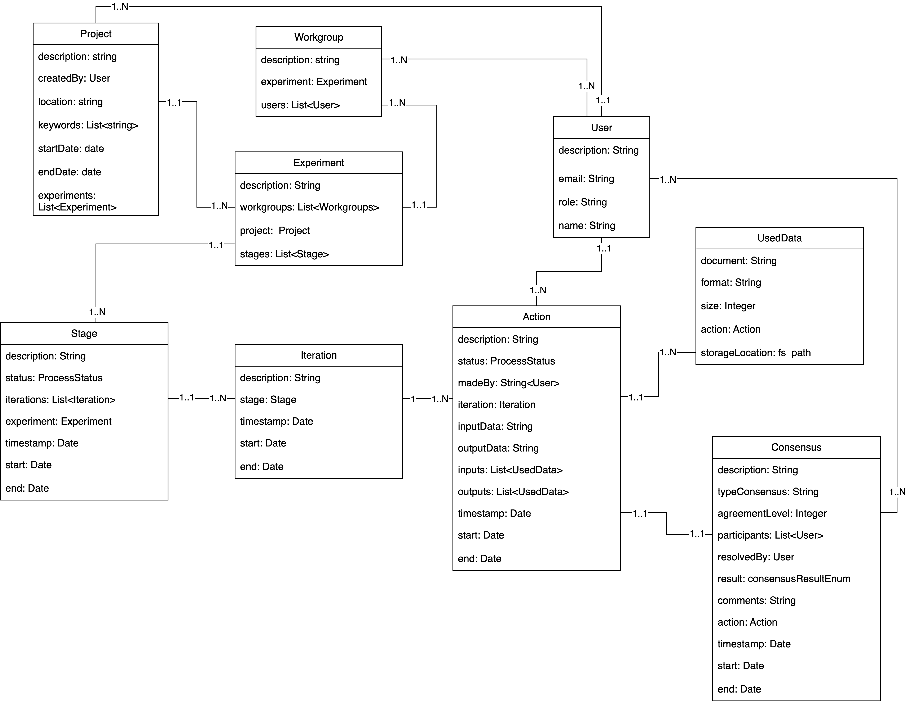

# Thesis Project Overview

This repository contains my master’s thesis, which demonstrates the application of the **Research Processes Curation Metamodel (RPCM)**, a model designed to represent the complete lifecycle of data-driven projects. As part of this work, a [pipeline](./pipeline/) was implemented to transform metadata extracted from Kaggle projects into RPCM entities.

<figure style="width: 100%; text-align: center; margin: 0;">
  
  <figcaption style="
      font-family: inherit;  
      font-size: 1em;        
      font-style: italic;   
      text-align: center;
      margin-top: 0.5em;">
    Research Processes Curation Metamodel <b>(RPCM)</b>
  </figcaption>
</figure>

## Demo

If you would like to explore the pipeline implemented, you can access the Streamlit app here: https://letitia-app-mk5m8vps4krnqyxhljl9cw.streamlit.app/

## How to execute

### ⚙️ Environment Setup

The environment is built with **Docker** using an **Apache Atlas** container.  
The folder [rpcm-atlas](./rpcm-atlas) includes an `atlas.yml` file that defines the Atlas image and mounts volumes with three JSON files:  

- `Entitydefs.json`: Json that contains RPCM entities definitions ready for ingestion into Atlas.  
- `graffiti_project.json`: A JSON file containing RPCM instances of entities derived from the real use case.
- `entities-bulk-atlas.json`: The output of the pipeline that consists of Kaggle metadta represented in RPCM.

### Start Atlas

Pull and start the Atlas container:

```bash
docker-compose -f atlas.yml pull
docker-compose -f atlas.yml up atlas
```
✅ Check that the container is running
```bash
docker ps
```
🔑 Access the container
```bash
docker exec -it <container_id> /bin/bash
apt update && apt install -y curl
```

📥 Ingesting Entities into Atlas
1. RPCM Entity Definitions
```
curl -u admin:admin -X POST -H "Content-Type: application/json" \
-d @/tmp/Entitydefs.json \
http://localhost:21000/api/atlas/v2/types/typedefs
```
2. Use Case Instances (Graffiti Project)
```bash
curl -u admin:admin -X POST -H "Content-Type: application/json" \
-d @/tmp/graffiti_project.json \
http://localhost:21000/api/atlas/v2/entity/bulk
```
3. Pipeline Results (Kaggle Projects)
```bash
curl -u admin:admin -X POST -H "Content-Type: application/json" \
-d @/tmp/entities-bulk-atlas.json \
http://localhost:21000/api/atlas/v2/entity/bulk
```

## 🔍 Queries

Once the RPCM entities and instances have been ingested into Apache Atlas, you can explore them through queries.


**Example - List projects and their creators:**
```SQL
FROM Project SELECT createdBy
```
